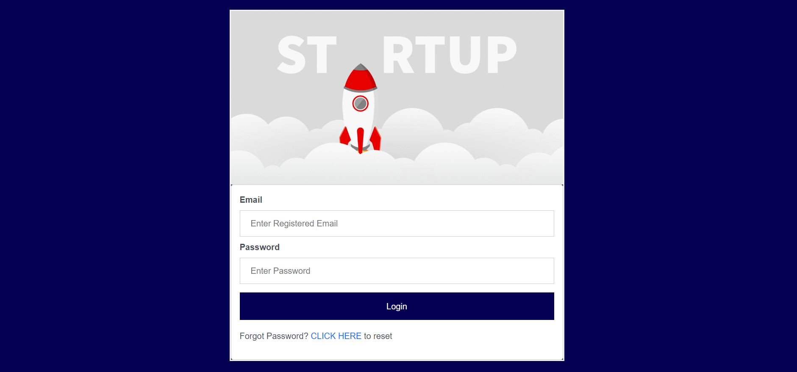

# Laravel-Authentication
This is a Laravel 9 project that implements user authentication, password reset, and a dashboard page with various sections for data representation using DataTables.

## Prerequisites

- PHP >= 8.0
- Composer
- Node.js and NPM

## Installation

1. Clone the repository: *git clone <repository-url>*

2. Navigate to the project directory:*cd project-directory*

3. Install PHP dependencies: *composer install*

4. Install JavaScript dependencies:*npm install*

5. Create a copy of the `.env.example` file and rename it to `.env`. Update the necessary configuration values, such as database credentials and **SMTP** mail credentials using which you can send the password reset link to the users email.

6. Generate an application key:*php artisan key:generate*

7. Run the database migrations to create the required tables:*php artisan migrate*

8. Serve the application using the built-in PHP development server:*php artisan serve*

9. Open your browser and visit `http://localhost:8000` to access the application.

## Usage

1. Register a new user by visiting the registration page (`/register`). (Uncomment the registration routes in `routes/web.php` if needed)

2. Log in with your credentials on the login page (`/`).

3. If you forget your password, click on the "Forgot Your Password?" link on the login page. Enter your email address and click "Send Password Reset Link." You will receive an email with instructions to reset your password.

4. After logging in, you will be redirected to the dashboard page. The sidebar contains different sections. Most sections use DataTables to represent data from the database.

5. To change your password, click on the "Change Password" section in the sidebar. After changing your password, you will be redirected to the login page to log in again.

6. To log out, click on the "Logout" section in the sidebar. You will be logged out of the application and redirected to the login page.

## Features

- User authentication: Users can register, log in, and log out.
- Password reset: Users can reset their passwords if forgotten.
- Dashboard page: Accessible only after successful login, providing various sections for data representation.
- DataTables: Used in most sections of the dashboard for visually appealing data representation.
- Change password: Users can change their passwords from the dashboard, ensuring account security.

## Contributing

Contributions are welcome! If you find any issues or want to suggest improvements, please open an issue or submit a pull request.

## Screenshots

Here are some screenshots of the project:

